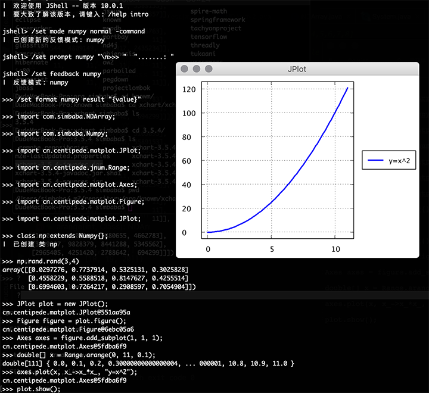
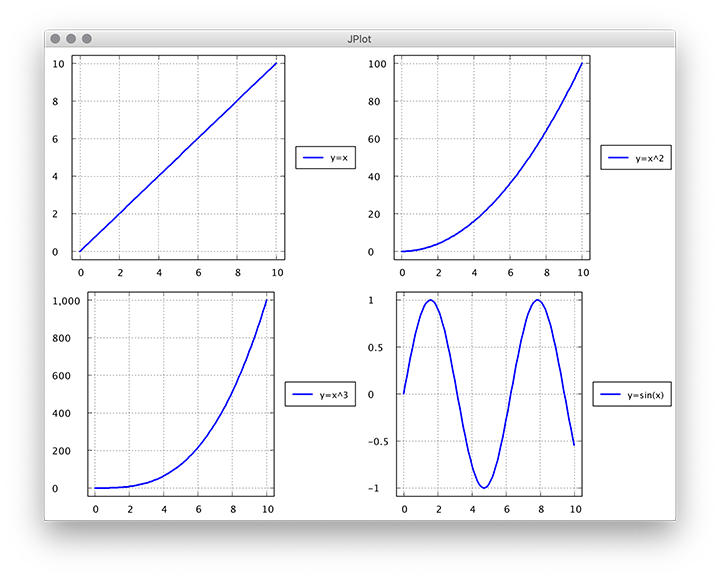

# deepro

#### 项目介绍
人工智能基础教程，使用Latex编写，基于Java实现。
1. Numpy参考实现
2. Matplot参考实现
3. AI基础算法实现

#### 参与人员
1. simbaba
2. jianyang
3. Tatsumi
4. xiaohui

#### 示例代码
与Python相关接口非常相近，从Python迁移到Java非常容易。
Similar to Python, you can quikly shift from Python to Java.

#### jshell中的运行效果：


#### matplot的运行效果：


```java
public static void showSubPlot() {
    JPlot plot = new JPlot();
    double[] x = Range.arange(0, 10, 0.1);

    Figure figure = plot.figure();
    Axes axes = figure.add_subplot(2, 2, 1);
    axes.plot(x, v->v, "y=x");

    axes = figure.add_subplot(2, 2, 2);
    axes.plot(x, v->v*v, "y=x^2");

    axes = figure.add_subplot(2, 2, 3);
    axes.plot(x, v->v*v*v, "y=x^3");

    axes = figure.add_subplot(2, 2, 4);
    axes.plot(x, v->Math.sin(v), "y=sin(x)");

    plot.show();
}
```
Numpy算法实现，支持Vector和Matrix，接口与Numpy基本一致。

```java
package cn.centipede.numpy;

@Test
public void test_api_at() {
    NDArray a = Numpy.arange(12).reshape(3,4);
    int[] expected = {4,5,6,7};
    assertEquals(Numpy.array(expected), a.at(1));
    assertEquals(Numpy.array(6), a.at(1,2));
}

@Test
public void test_api_atRange() {
    NDArray a = Numpy.arange(36).reshape(4,3,3);
    int[] expected = {8, 17};
    int[][] range = {{0,2}, {2}, {-1+3}}; // not support negative, but slice can
    assertEquals(Numpy.array(expected), a.atRange(range));
}

@Test
public void test_shape() {
    int[] dat = new int[]{2,4};
    NDArray a = Numpy.array(dat);
    assertEquals("(2,)", a.shape());
}

@Test
public void test_slice() {
    NDArray a = Numpy.arange(12).reshape(3,4);
    int[][] range1 = {{1, 3}, {-1}};
    NDArray b = a.slice(range1);
    assertEquals("array([7, 11])\n", b.toString());

    int[][] range2 = {{ALL}, {-2}};
    b = a.slice(range2);
    assertEquals("array([2, 6, 10])\n", b.toString());

    int[][] range3 = {{-2, -1}, {-2}};
    b = a.slice(range3);
    assertEquals("array([6])\n", b.toString());

    int[][] range4 = {{-1}, {-2}};
    b = a.slice(range4);
    assertEquals("10", b.toString());
}

@Test
public void test_broadcast() {
    NDArray a = Numpy.arange(12).reshape(3,4);
    NDArray b = Numpy.add(a, 2);

    assertEquals("array([[2 , 3 , 4 , 5 ]\n" +
        "       [6 , 7 , 8 , 9 ]\n" +
                "       [10, 11, 12, 13]])\n", b.toString());

    b = Numpy.sub(b, 2);
    assertEquals("array([[0 , 1 , 2 , 3 ]\n" +
                "       [4 , 5 , 6 , 7 ]\n" +
                "       [8 , 9 , 10, 11]])\n", b.toString());

    int[] dat = {10, 20, 30, 40};
    NDArray c = Numpy.add(a, dat);

    assertEquals("array([[10, 21, 32, 43]\n" +
        "       [14, 25, 36, 47]\n" +
                "       [18, 29, 40, 51]])\n", c.toString());
}

@Test
public void test_arange() {
    NDArray a = Numpy.arange(12).reshape(3,4);
    assertEquals("(3, 4)", a.shape());
}

@Test
public void test_random() {
    NDArray a = Numpy.random.rand(4,4);
    System.out.println(a);
    assertEquals("(4, 4)", a.shape());
}

@Test
public void test_ndarray_add() {
    NDArray a = Numpy.ones(3,4);
    NDArray b = Numpy.zeros(3,4);
    NDArray c = Numpy.add(a, b);
    System.out.println(c);
}

@Test
public void test_ndarray_dot() {
    NDArray a = Numpy.arange(12).reshape(3,4);
    NDArray b = Numpy.arange(16).reshape(4,4);
    NDArray c = Numpy.dot(a, b);

    assertEquals(
        "array([[56 , 62 , 68 , 74 ]\n"+
        "       [152, 174, 196, 218]\n"+
        "       [248, 286, 324, 362]])\n", c.toString());

    NDArray d = Numpy.arange(12).reshape(3,4);
    NDArray e = Numpy.dot(d, 2);
    assertEquals(e, Numpy.add(d, d));

    d = Numpy.arange(12).reshape(3,4);
    e = Numpy.array(2);
    assertEquals(Numpy.dot(d, 2), Numpy.dot(d, e));

    d = Numpy.arange(12).reshape(3, 4);
    e = Numpy.array(new int[]{1, 2, 3, 4});
    assertEquals(Numpy.array(new int[]{20, 60, 100}), Numpy.dot(d, e));
}

@Test
public void test_struct() {
    NDArray a = Numpy.arange(24).reshape(2,3,4);
    int[][][] array = (int[][][])Numpy.getArray(a);
    
    int[][][] real = new int[][][]{
        {{0, 1, 2, 3}, {4, 5, 6, 7}, {8, 9, 10, 11}}, 
        {{0, 1, 2, 3}, {4, 5, 6, 7}, {8, 9, 10, 11}}
    };
    
    assertEquals("3 dimens int[][][] array", Arrays.deepToString(array), Arrays.deepToString(real));
}
```
